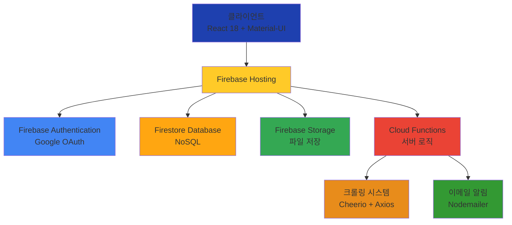

# ajouproject
# 📚 AIM AJOU - 반응형 웹앱 SaaS 포트폴리오 관리 시스템

<div align="center">


[](https://portfolio.ajou.sw.kr)
[](https://github.com/nowijnah/ajouproject)

**학생, 교수, 기업, 관리자를 연결하는 통합 포트폴리오 관리 시스템**

</div>

---

## 📖 프로젝트 소개

**AIM AJOU**는 아주대학교 구성원들의 프로젝트 결과물을 체계적으로 관리하고, 외부에 효과적으로 공개할 수 있도록 지원하는 반응형 웹 기반 SaaS 플랫폼입니다.

### 🎯 프로젝트 목표

- 📌 학생들의 포트폴리오를 체계적으로 관리하고 취업 경쟁력 강화
- 🔍 교수 및 연구실의 연구 성과 관리 및 홍보
- 🤝 기업과 대학 간 산학협력 연계 강화
- 💻 모든 디바이스에서 최적화된 사용자 경험 제공

### ⚠️ 해결하고자 하는 문제

```
❌ 학생들의 프로젝트 결과물이 체계적으로 관리되지 않아 졸업 후 사장됨
❌ 기업이 우수한 인재를 발굴하는 데 어려움
❌ 포트폴리오 관리를 위한 통합 플랫폼 부재
```

---

## ✨ 주요 기능

<table>
<tr>
<td width="50%">

### 🎨 포트폴리오 관리
- **마크다운 기반 에디터**로 리치 텍스트 작성
- **드래그 앤 드롭** 파일 업로드
- **키워드 태그** 시스템으로 분류
- **실시간 미리보기** 및 자동 저장

</td>
<td width="50%">

### 🔐 사용자 관리
- **Google OAuth** 기반 인증
- **역할별 접근 제어** (학생/교수/기업/관리자)
- **프로필 관리** 및 알림 설정
- **아주대 이메일** 인증 제한

</td>
</tr>
<tr>
<td width="50%">

### 🔍 검색 & 필터링
- **키워드 기반 실시간 검색**
- **다양한 필터** (기술 스택, 카테고리)
- **정렬 옵션** (최신순, 인기순)
- **무한 스크롤** 페이지네이션

</td>
<td width="50%">

### 💬 커뮤니티 기능
- **실시간 댓글** 및 대댓글
- **좋아요** 기능
- **이메일 알림** 자동 발송
- **사용자별 알림 설정**

</td>
</tr>
</table>

### 🤖 자동화 시스템

- **소프트콘 프로젝트 자동 크롤링** (Cheerio 활용)
- **학기별/카테고리별 데이터 수집**
- **실시간 크롤링 진행 상황 모니터링**
- **Firestore 자동 저장**

---

## 🎬 사용 방법

### 📝 학생 사용자

```
1️⃣ Google 계정으로 로그인 (아주대 이메일)
2️⃣ 마크다운 에디터로 프로젝트 작성
3️⃣ 이미지, PDF 등 파일 첨부
4️⃣ 키워드 태그 설정
5️⃣ 게시 및 공유
```

### 👨‍🏫 교수 사용자

```
1️⃣ 연구실 정보 등록
2️⃣ 학생 포트폴리오 검색 및 검토
3️⃣ 댓글로 피드백 제공
4️⃣ 연구 성과 공유
```

### 🏢 기업 사용자

```
1️⃣ 기업 정보 등록
2️⃣ 기술 스택/프로젝트 경험 기반 인재 검색
3️⃣ 관심 학생에게 직접 컨택
4️⃣ 산학협력 프로젝트 매칭
```

### ⚙️ 관리자

```
1️⃣ 사용자 권한 관리 (차단/해제)
2️⃣ 콘텐츠 관리 및 승인
3️⃣ 소프트콘 자동 크롤링 실행
4️⃣ 공지사항 발행
```

---

## 📅 개발 기간

```
📆 2025년 1학기 (16주)
🗓️ 2025년 3월 ~ 2025년 6월
```

### 개발 단계

| 주차 | 단계 | 주요 내용 |
|:---:|:---:|:---|
| 1-3주 | 기획 및 설계 | 요구사항 분석, UI/UX 디자인, 개발 환경 구축 |
| 4-7주 | 핵심 기능 구현 | 인증 시스템, 기본 UI, 포트폴리오 CRUD |
| 8-10주 | 고급 기능 구현 | 검색/필터링, 마크다운 에디터, 댓글/좋아요 |
| 11-13주 | 관리자 & 안정화 | 관리자 페이지, 사용자 테스트, 성능 최적화 |
| 14-16주 | 최종 완성 & 배포 | 반응형 디자인, 프로덕션 배포, 최종 발표 |

---

## 🛠️ 사용 기술

### Frontend

<div align="center">


</div>

### Backend (Serverless)

<div align="center">


</div>

### Tools & Libraries

<div align="center">


</div>

### Development

<div align="center">


</div>

---

## 🏗️ 시스템 아키텍처



---

## 👥 팀원 소개

<table align="center">
<tr>
<td align="center" width="50%">
<br />
<b>권세빈</b><br />
<sub>202220781</sub><br />
<a href="https://github.com/sebeeeen">

</a><br />
<sub>💻 Full-Stack Developer</sub><br />
<sub>📧 a856412@gmail.com</sub>
</td>
<td align="center" width="50%">
<br />
<b>한지원</b><br />
<sub>202220786</sub><br />
<a href="https://github.com/nowijnah">

</a><br />
<sub>💻 Full-Stack Developer</sub><br />
<sub>nowijnah@ajou.ac.kr</sub>
</td>
</tr>
</table>

### 👨‍🏫 지도교수

**최재영 교수님** (mobilechoi@ajou.ac.kr)

### 🎯 멘토

- **김정훈** (라인플러스)
- **이승윤** (쿠팡)

---

## 📊 프로젝트 성과

<div align="center">

### 개발 규모


### 성능 지표


### 사용자 테스트


</div>

---

## 🎯 주요 성과

### ✅ 기술적 성과

- ✨ **Firebase 서버리스 아키텍처** 완전 구현
- 🚀 **50개 이상** 재사용 가능한 React 컴포넌트 개발
- 📝 **마크다운 기반** 리치 텍스트 에디터 시스템 구축
- 💬 **실시간 댓글 및 좋아요** 커뮤니티 플랫폼 구현
- 🤖 **자동화된 크롤링** 및 데이터 관리 시스템 개발
- 📱 **모든 디바이스 최적화** 반응형 디자인 구현

### 📈 성능 개선

- ⚡ 페이지 로딩 시간: **3.2초 → 1.8초** (44% 개선)
- 🖼️ 이미지 로딩: **2.1초 → 0.9초** (57% 개선)
- 🔍 검색 응답 시간: **1.5초 → 0.6초** (60% 개선)

---

## 📂 프로젝트 구조

```
ajouproject/
├── public/                    # 정적 파일
├── src/
│   ├── components/           # React 컴포넌트
│   │   ├── auth/            # 인증 (AuthContext, ProtectedRoute)
│   │   ├── card/            # 콘텐츠 카드
│   │   ├── common/          # 공통 컴포넌트
│   │   ├── home/            # 홈페이지
│   │   ├── posts/           # 게시물 (MarkdownEditor, FileUploader)
│   │   └── settings/        # 설정
│   ├── pages/                # 페이지
│   │   ├── admin/           # 관리자
│   │   ├── portfolios/      # 포트폴리오
│   │   ├── labs/            # 연구실
│   │   └── companies/       # 기업
│   ├── firebase.js          # Firebase 설정
│   ├── App.js               # 메인 앱
│   └── index.js             # 엔트리 포인트
├── functions/                # Firebase Cloud Functions
│   ├── index.js             # 크롤링, 이메일 알림
│   └── package.json
├── webpack.config.js         # Webpack 설정
└── package.json              # 의존성 관리
```

---

## 🚀 시작하기

### 필수 요구사항

- Node.js 20.x 이상
- npm 또는 yarn
- Firebase 계정

### 설치 방법

```bash
# 1. 저장소 클론
git clone https://github.com/nowijnah/ajouproject.git
cd ajouproject

# 2. 의존성 설치
npm install

# 3. Firebase 설정
# firebase.js에 Firebase 설정 추가

# 4. 개발 서버 실행
npm start

# 5. 프로덕션 빌드
npm run build

# 6. Firebase Functions 배포
cd functions
npm install
firebase deploy --only functions
```

### 환경 변수 설정

```env
REACT_APP_FIREBASE_API_KEY=your_api_key
REACT_APP_FIREBASE_AUTH_DOMAIN=your_auth_domain
REACT_APP_FIREBASE_PROJECT_ID=your_project_id
REACT_APP_FIREBASE_STORAGE_BUCKET=your_storage_bucket
REACT_APP_FIREBASE_MESSAGING_SENDER_ID=your_sender_id
REACT_APP_FIREBASE_APP_ID=your_app_id
```

---

## 📝 주요 코드 예시

### 🔐 인증 시스템

```javascript
// AuthContext.js - Google OAuth 인증
export const AuthProvider = ({ children }) => {
  const [currentUser, setCurrentUser] = useState(null);
  
  useEffect(() => {
    const unsubscribe = onAuthStateChanged(auth, async (user) => {
      if (user) {
        const userDoc = await getDoc(doc(db, 'users', user.uid));
        const userData = userDoc.data();
        setCurrentUser({ ...user, role: userData?.role });
      }
      setLoading(false);
    });
    return unsubscribe;
  }, []);
};
```

### 🤖 자동 크롤링 시스템

```javascript
// functions/index.js - 소프트콘 크롤링
exports.crawlSoftconData = functions.https.onCall(async (data, context) => {
  const { term, category } = data;
  const $ = await getHtml(url);
  
  // 프로젝트 목록 추출
  $("li.vw_close").each((_, el) => {
    const uid = extractUID($(el));
    const thumbnail = extractThumbnail($(el));
    const title = extractTitle($(el));
    projects.push({ uid, thumbnail, title });
  });
  
  // Firestore에 저장
  await docRef.set(transformForFirestore(detail, term, category));
});
```

### 💬 실시간 댓글 시스템

```javascript
// 실시간 댓글 구독
useEffect(() => {
  const unsubscribe = onSnapshot(
    query(collection(db, `${collectionName}_comments`),
      where('postId', '==', postId),
      orderBy('createdAt', 'desc')),
    (snapshot) => setComments(snapshot.docs.map(doc => ({
      id: doc.id, ...doc.data()
    })))
  );
  return unsubscribe;
}, [postId]);
```

---

## 📄 라이선스

이 프로젝트는 [MIT License](LICENSE)를 따릅니다.

---

## 📞 문의

프로젝트에 대한 문의사항이나 제안이 있으시면 아래로 연락 주세요:

- **Email**: a856412@gmail.com
- **Website**: [https://portfolio.ajou.sw.kr](https://portfolio.ajou.sw.kr)
- **GitHub Issues**: [프로젝트 이슈](https://github.com/nowijnah/ajouproject/issues)

---

## 🙏 감사의 말

본 프로젝트는 아주대학교 소프트웨어학과 2025-1학기 자기주도 프로젝트로 진행되었습니다.

- **지도교수**: 최재영 교수님
- **멘토**: 김정훈 (라인플러스), 이승윤 (쿠팡)
- **베타 테스터**: 아주대학교 소프트웨어학과 학우 20명

---

<div align="center">


**Made with ❤️ by 권세빈 & 한지원**

[](#-aim-ajou---반응형-웹앱-saas-포트폴리오-관리-시스템)

</div>